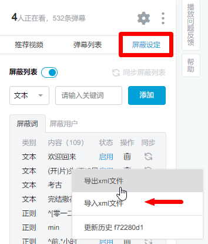

# 哔哩哔哩弹幕屏蔽规则
  
这个弹幕规则本意是自用的，是否使用请根据您自身的需求和接受能力。

# 使用方式
1. 右键 [最新规则](https://github.com/fang2hou/Bilibili-block-list/raw/master/Bilibili-block-list.xml) 保存。
2. 在 Bilibili.com 的播放器设定区导入。

# 规则说明
[查看规则](Bilibili-block-list.xml)

1. 片头片尾
2. 倍速
3. 幼稚许愿
4. 炫耀会员
5. 无脑爱国
6. 侮辱性表现
7. 各类低智商刷屏

# 误伤程度
自我评定为 **轻微误伤**  

# 来源
主要为自己手动添加。  
部分额外规则来源：
- [Bilibili 屏蔽词分享平台](https://harrynull.tech/bilibili/)
- [jnxyp/Bilibili-Block-List](https://github.com/jnxyp/Bilibili-Block-List)